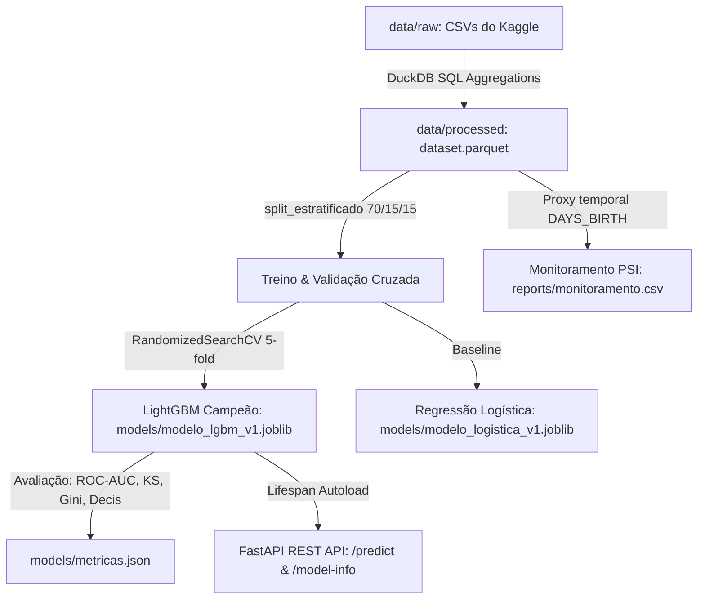

# Credit-Lens 🔍

[](https://github.com/elycbarros/credit-lens/actions)
[](https://python.org)
[](https://fastapi.tiangolo.com)
[](https://duckdb.org)

Sistema de avaliação de **Risco de Crédito Ponta a Ponta**: da ingestão relacional com DuckDB ao deploy de API REST com FastAPI, passando por modelagem supervisionada (LightGBM vs. Regressão Logística), avaliação com métricas de crédito (ROC-AUC, KS, Gini) e monitoramento de drift populacional (PSI).

> [!NOTE]
> **Aviso de conformidade e uso ético:** Projeto acadêmico e demonstrativo para portfólio de engenharia de dados e machine learning utilizando dados públicos do [Home Credit Default Risk (Kaggle)](https://www.kaggle.com/c/home-credit-default-risk/data). **Não deve ser utilizado para decisões reais de crédito.** Consulte os detalhes em [`docs/dados_e_limitacoes.md`](docs/dados_e_limitacoes.md).

---

## 📊 Resultados e Performance

Avaliação em conjunto de teste holdout independente (15% da base, 46.127 clientes) após treino estratificado (70%) e validação (15%):

| Modelo | ROC-AUC (Teste) | Gini (Teste) | KS Statistic (Teste) | PR-AUC | Brier Score | Status |
|---|---|---|---|---|---|---|
| **Regressão Logística** | 0.6811 | 0.3621 | 0.2667 | 0.1601 | 0.2256 | Baseline |
| **LightGBM (Tuned 5-fold CV)** | **0.7093** | **0.4187** | **0.3097** | **0.1871** | **0.2031** | **Campeão** |

* **Validação Cruzada**: LightGBM obteve **CV ROC-AUC médio de 0.7002 ± 0.0036** ao longo dos 5 folds estratificados.
* **Calibração:** os modelos são treinados com pesos de classe, então o score bruto (média ~0,45) não é probabilidade (taxa real ~8%). A calibração isotônica, ajustada na validação, leva a probabilidade média prevista a 8,05% (observada: 8,07%), com **Brier 0,2031 → 0,0705** e **ECE 0,346 → 0,003**, e ROC-AUC praticamente igual (0,7085). A API usa o modelo calibrado (`modelo_lgbm_v2.joblib`).
* **Faixas de risco (API):** baixo < 6%, médio 6–15%, alto ≥ 15% de probabilidade calibrada (`CORTE_RISCO_BAIXO/ALTO` em `api.py`).
* **Model Card Completo**: Veja hiperparâmetros, curvas e detalhes em [`docs/model_card.md`](docs/model_card.md).

---

## 📈 Dashboard (Tableau Public)

Exportação de dados agregados para BI com `make bi` (`scripts/exportar_para_bi.py`). Estrutura das páginas, valores de conferência e cuidados de interpretação em [`docs/dashboard.md`](docs/dashboard.md). Link público: _em breve_.

---

## 🏗️ Arquitetura do Pipeline



---

## ⚡ Como Executar

### 1. Pré-requisitos e Instalação

```bash
# Clone e crie o ambiente virtual
git clone https://github.com/elycbarros/credit-lens.git
cd credit-lens
python3 -m venv .venv && source .venv/bin/activate

# Instala dependências
make install
```

### 2. Dados

Baixe os 4 CSVs da competição [Home Credit Default Risk](https://www.kaggle.com/c/home-credit-default-risk/data) e coloque em `data/raw/`:
- `application_train.csv`
- `bureau.csv`
- `previous_application.csv`
- `installments_payments.csv`

### 3. Pipeline de Dados e Treinamento

```bash
# 1. Processa 307.511 linhas e 32 preditores em segundos via DuckDB
make features

# 2. Executa testes unitários e de integração (25 testes, >90% coverage)
make test

# 3. Treina o baseline de Regressão Logística
make train-logistica

# 4. Treina o campeão LightGBM com tuning 5-fold CV (já calibra as probabilidades)
make train

# 4b. Alternativa: calibrar um modelo já treinado, sem retreinar
# python -m credit_lens.calibracao --modelo lgbm --origem 1 --destino 2

# 5. Gera relatório de monitoramento populacional (PSI)
make monitor
```

### 4. Executando a API REST

```bash
# Inicia a API FastAPI localmente
make api
```

Acesse a documentação interativa OpenAPI no navegador: **http://localhost:8000/docs**

Exemplo de chamada `POST /predict`:
```bash
curl -X POST "http://localhost:8000/predict" \
     -H "Content-Type: application/json" \
     -d '{
       "AMT_INCOME_TOTAL": 180000.0,
       "AMT_CREDIT": 450000.0,
       "AMT_ANNUITY": 22500.0,
       "DAYS_BIRTH": -14000,
       "DAYS_EMPLOYED": -1800
     }'
```

Resposta:
```json
{
  "probabilidade_inadimplencia": 0.064706,
  "faixa_risco": "médio",
  "modelo": "modelo_lgbm_v2.joblib"
}
```

---

## 📂 Estrutura do Projeto

```
credit-lens/
├── sql/                   # Agregações SQL analíticas executadas no DuckDB
│   ├── 01_bureau_agg.sql
│   ├── 02_prev_app_agg.sql
│   ├── 03_installments_agg.sql
│   └── 99_dataset_final.sql
├── src/credit_lens/       # Módulos Python em arquitetura limpa
│   ├── features.py        # Ingestão e pipeline DuckDB -> Parquet
│   ├── split.py           # Split estratificado e temporal
│   ├── train.py           # Treinamento com Scikit-Learn e LightGBM
│   ├── evaluate.py        # Métricas de crédito: Gini, KS e Tabela de Decis
│   ├── monitor.py         # Cálculo de Population Stability Index (PSI)
│   └── api.py             # API REST FastAPI com validação Pydantic
├── tests/                 # Suíte de testes automatizados com Pytest
├── docs/                  # Documentação, Model Card e Limitações
├── notebooks/             # Análise Exploratória de Dados (01_eda.ipynb)
├── Makefile               # Comandos de automação do ciclo de desenvolvimento
└── pyproject.toml         # Configuração de build, linters e cobertura
```

---

## ⚖️ Licença

Distribuído sob a licença MIT. Veja `LICENSE` para mais informações.
